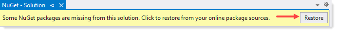

# About

This repository contains a Entity Framework Core language extension for finding multiple keys in a model.

# Step 1

Read the following article

[Microsoft TechNet article](https://social.technet.microsoft.com/wiki/contents/articles/53841.entity-framework-core-find-all-by-primary-key-c.aspx)

# Step 2 - Before running any code

Using SSMS (SQL-Server Management Studio) create a new database named `NorthWindAzureForInserts`. Once created run the script in NorthWindScript.sql

# Step 3 -  Steps to run code

- Open Solution Explorer
  - Right click on top node
  - Select `Manage NuGet Packages for this solution`
  - A new window appears
  - In the upper right corner select `Restore`, wait for process to finish (see **figure 1**).
- Right click on top node of Solution Explorer
  - Select `Rebuild Solution`
- Right click on the node `WindowsFormsApp2` in Solution Explorer
  - Select `Set as Startup project`
- Click the Start button under Visual Studio's menu to run the project

### Figure 1

# Screen shot

 