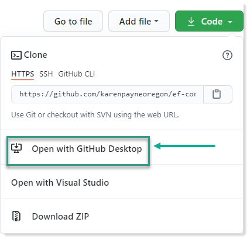
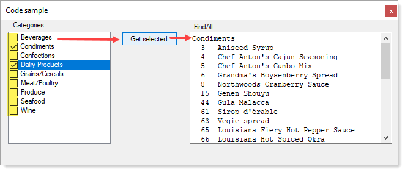
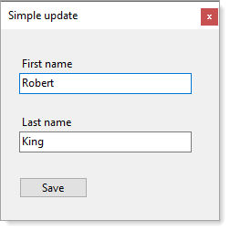

# About

This Visual Studio solution was originally for a Microsoft article [Entity Framework Core Find all by primary key (C#)](https://social.technet.microsoft.com/wiki/contents/articles/53841.entity-framework-core-find-all-by-primary-key-c.aspx).

Currently has a class and form project to demonstrate code for the above article along with two new projects to show simple editing a record using a newer version of Entity Framework Core and C#9.

## Requires

The following

- Visual Studio [2019](https://visualstudio.microsoft.com/vs/)
- [SSMS](https://docs.microsoft.com/en-us/sql/ssms/sql-server-management-studio-ssms?view=sql-server-ver15)
- [.NET Core 5](https://dotnet.microsoft.com/download)

## First steps

- Clone this repository, see **Clone repository** below. Best using [GitDesktop](https://desktop.github.com/) while using **Download ZIP** usually sets `mark of the web` and if so Visual Studio will not compile, use PowerShell code found [here](#Unblock-Files-in-Folder).
- Using [SSMS](https://en.wikipedia.org/wiki/SQL_Server_Management_Studio) (SQL-Server Management Studio) 
  - Create a new database named `NorthWindAzureForInserts`. 
  - Once created run the script in [NorthWindScript.sql](https://github.com/karenpayneoregon/ef-core-findall-cs/blob/master/SampleLibrary/NorthWindScript.sql)


### Clone repository




Screenshot for original code sample



Screenshot for CRUD example



:red_circle: Normally desktop application would not be used, instead unit test projects so that the code may be used in a desktop or web application. Since many developers avoid unit test this is the reason for desktop projects.


## Unblock Files in Folder

Using PowerShell to unblock mark of the web in a PowerShell window.  Replace `[directory path]` with the root folder to run on.

```ps
    dir -Path [directory path] -Recurse | Unblock-File
    Get-ChildItem -Path '[directory path]' -Recurse | Unblock-File
```